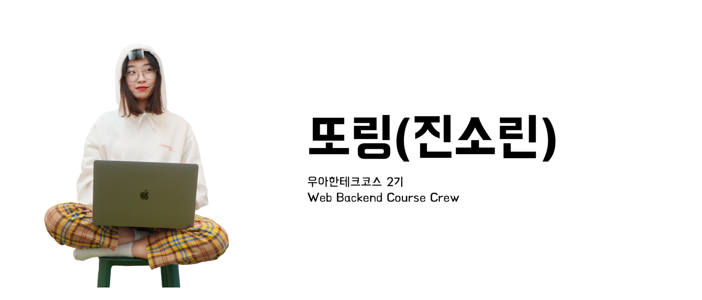
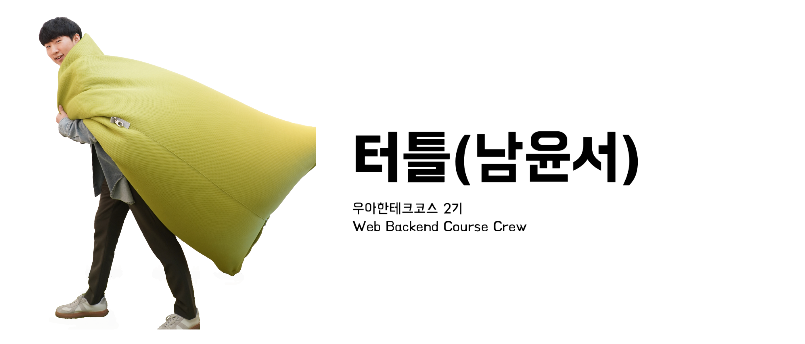

안녕하세요 우아한 테크코스 2기, 셀러리 컴퍼니에서 [직고래](https://play.google.com/store/apps/details?id=com.sellerleecompany.jikgorae)를 개발하고 있는 서브웨이입니다.
우아한 테크코스 2기 레벨3가 마무리되면서 셀러리 팀원들이 팀 프로젝트에 대한 회고를 진행하였는데요.
저희 팀원들의 회고 내용을 공유하고자 합니다.

---

### 당신은 누구인가요?
안녕하세요. 셀러리 서비스를 개발 중인 셀러리 컴퍼니의 또링입니다.
직책은 따로 없고, **개발자 1** 혹은 **팀원 1**로서 맡은 역할을 충실히 하고 있습니다.

### 왜 가지마켓, 아니 셀러리를 선택했어요?
레벨2 마지막 주쯤으로 거슬러 올라가 볼게요.
그때 생각만 하면 아직도 고민이 되네요. 그 당시 저는 아이디어 10개의 우선순위를 정해야 했어요.
선택 기준은 "정말 서비스로 만들 만한 아이디어인가?"였어요.
그동안 여러 프로젝트를 해보면서 느낀 건데 아이디어가 재미없고 매력이 없으면 의욕이 잘 안 생기더라고요.
그래서 이런 이유로 순위를 정했고, 그 결과 셀러리의 팀원이 될 수 있었습니다.

### 팀이 결성되었을 때 어떤 기분이었어요?
아이디어만큼 가장 중요한 게 팀원들이었기 때문에 팀 발표날까지 정말 기다렸던 기억이 나요.
그렇게 기다렸던 팀이 발표되었는데 그때 딱 든 감정은 안도감 반 지루함 반이었어요.
사실 우테코를 진행하며 사이드 프로젝트를 한 적이 있는 데요, 그때 같이 했던 팀원 2명이 또 같은 팀이 되었거든요.
그뿐이에요? 팀원 4명 중 3명과는 페어 경험도 있었어요.
그래요, 솔직히 신선하지 않았어요. 새로운 사람들과 팀을 해보고 싶었거든요.
그래도 잘 해낼 수 있을 거라는 안도감과 재미있을 거라는 기대를 안고 프로젝트를 시작했어요.

### 프로젝트를 시작할 때 어떤 다짐을 했고, 잘 이루어지고 있나요?
음…. 많은 다짐을 했었는데, 가장 기억에 남는 건 **책임감 있게 내가 맡은 일을 해내자** 인 것 같아요.

이 질문에 대해선 명쾌하게 “그렇다”라는 답을 못하겠네요.
제가 맡은 이슈들을 해결하긴 했는데, 기간을 못 지켰거든요.
특히 셀러리 컴퍼니 팀 문화 중 _PR 요청은 해당 주차의 목요일 자정까지 완료한다._ 라는 항목이 있어요.
하지만 대부분의 이슈를 금요일이 지나서야 완료했죠.
왜 이런 문제가 발생했는지 생각을 해봤어요.

***“일정 산출을 잘못했나?” , “내가 책임감이 없나?”***

결론은 둘 다인 것 같아요. 마냥 책임감이 없다고 하기에는 주어진 근무시간 내에서 최선을 다했고, 못 끝낸 이슈가 있으면 근무 시간 외에도 끝내보려고 노력했거든요.
또, 그렇다고 마냥 일정 산출을 잘못했다고 하기에는…. 아마도 밤을 새웠다면 지킬 수 있었을 테니까요?

그래서 이제는 둘 다 잘해보려고요.
아무리 많은 이슈를 끝내고 싶더라도 욕심부려 일정을 빡빡하게 잡지 않을 것이고, 
스스로 벌칙을 걸어서라도 약속한 날짜까지는 꼭 구현을 완료할 거예요!
(사실 최종 데모가 얼마 안 남은 상태에서 가능한 일인지는 모르겠지만요)

어쨌든, 저의 이런 다짐은 아직도 진행 중입니다. 

### 이전 팀 프로젝트들과 달랐던 점이 있나요?
그동안 학교 수업을 통틀어 12번 정도의 팀 프로젝트를 해왔는데요, 그중 4번 빼고는 다 팀장을 맡았었어요.
왜, 그런 사람들 있잖아요. 자기 파트 아닌데도 거슬리면 더 고생해서 보완하는, 전형적인 완벽주의자 타입이요. 딱 그랬어요.
그래서 사실 이번 프로젝트에서도 팀장을 하고 싶었어요. 근데 갑자기 그런 생각이 들더라고요.

***"그동안 리더로서의 칭찬 말고 팔로워로서의 칭찬을 들어봤던가?", "나는 팀원일 때 어떻게 행동했더라? 그리고 남이 날 어떻게 평가했더라?"***

맞아요. “아, 팀에는 리더만 존재하는 게 아닌데…. 나는 지금 팀원으로서의 경험도 부족하구나”라는 생각이 든 거죠.
그래서 "이번 프로젝트에서는 이끄는 사람보다는 따르는 사람이 되어야지"하고 생각했어요.

우선 스스로 가져야 할 마음가짐에 대해 생각해봤어요.
1. 팀장을 믿자
2. 너무 나서지 말자
3. 어느 정도 주장을 했지만 받아들여지지 않으면 원활한 진행을 위해 주장을 굽히자.

그래서 잘하고 있느냐고요? 네, 전 잘하고 있다고 생각해요.

항상 프로젝트를 진행할 때마다 기능명세서, 클래스 다이어그램, 시스템 아키텍처, 화면설계도, 간트 차트와 같은 것들을 미리 작성해 놓는 편이었어요.
그래야 일정 산출도 쉽고, 각 팀원이 같은 곳을 바라볼 수 있다고 생각했거든요.
그래서 이번에도 당연히 그런 것들을 하고 개발에 들어가야지 했는데, 팀원들이 아직 필요성을 모르겠대요.
지금 단계에서 필요한 게 맞느냐고 오히려 되묻더라고요. 
그 순간 혼자서 엄청난 고민을 했어요.

***"필요할 때 하면 되잖아." vs "당연히 있어야 하는 거 아니야?"***

도저히 답을 못 내리겠는 거예요.
그래서 그냥 팀장과 팀원들을 믿기로 했어요.
만약, 그 길이 틀리더라도 다시 돌아와서 작성하면 되는 것들이잖아요?
그래서 진행하다가 필요하다고 느껴지는 순간에 필요한 것들을 작성해 나갔어요. 굉장히 색다르더라고요.
제가 옳다고만 생각했고 항상 주장했던 것을 팀원들을 믿고 내려놓으니 또 다른 시야를 가지고 팀 프로젝트를 해나갈 수 있었어요.

나중에 팀장이 말해주더라고요.

***"네가 하던 방식을 버리기 쉽지 않았을 텐데, 의견 잘 따라줘서 고맙다"***

그렇게 주장하고 이끌고 결론짓고 방향을 찾아가던 나에게서 따르는 나로 변한 것이 가장 달라졌던 점이죠.

### 이견 조율은 어떻게 했어요?

_**제 의견이 다른 팀원의 의견과 엇갈린 경우에는요,**_

제 의견을 주장하다가 도저히 진전이 없으면 그냥 상대의 의견을 수용했어요.
포기라면 포기지만, 지쳐서 상대의 의견을 수용한 것보다는 팀원이 저렇게나 주장하는데 한번 믿어보자는 생각이 컸던 것 같아요.
그리고 노션에 간단히 메모했어요. _나는 이러한 이유로 A를 주장했고 팀원은 이러한 이유로 B를 주장했다._ 라고요. 
그렇게 프로젝트를 진행하다가 문제가 생긴다거나 다시 제 의견을 주장할 일이 생기면 메모를 바탕으로 다시 설득을 해요.
이런 식으로 이견을 조율해 나가니 서로 언쟁이 높아지거나, 시간이 한없이 지체되거나 하는 일이 잘 없더라고요. 

_**팀원 간의 의견 충돌이 발생한 경우에는요,**_ 

가만히 얘기를 듣다가 서로 설득시키기 위한 같은 말이 반복되는 순간, 잠깐 흐름을 끊고 정리를 해요. 
"A는 이러한 이유로 이런 선택을 하는 거고, B는 이러한 이유로 이런 선택을 한다는 거네?"와 같은 정리 말이에요. 
그렇게 정리를 한 번 하고 나머지 팀원들의 의견을 들어보려고 해요. 서로 생각을 환기할 수 있도록 초점을 다른 곳으로 잠깐 돌리는 거죠. 
그렇게 하면 절충안이 나온다든가 다수의 의견이 한곳으로 모이기도 해요. 이런 식으로 이견을 조율해왔었네요.

### 스스로 생각하기에 가장 안타까운 일은 무엇이었나요?
**선택과 집중의 실패**

가을이 다가오면서 하반기 채용이 시작되고 있는데요, 우테코가 끝나면 취직을 해야 했기에 프로젝트에 온전히 집중할 수 없었어요.
자기소개서도 써야 하고 포트폴리오도 만들어야 하고 코딩테스트, CS 공부, 면접 준비 등 할 게 정말 많잖아요.
그런데도 저는 욕심을 부려서 프로젝트도 잘하고 싶고 취업도 하고 싶었어요.
사실 1순위를 팀 프로젝트로 두고 시간을 쏟긴 했지만 머릿속에는 취업 생각이 둥둥 떠다녔어요.
그렇게 갈피를 못 잡은 채로 시간을 보내다가 얼마 전 포수타에서 답을 얻었죠.
***“취업과 프로젝트 둘 다 하려니 둘 다 놓치게 되는 것 같아요. 어떻게 하면 좋을까요?”***

딱 제 얘기였어요.

포비는 그럼 "한 가지를 선택해서 집중하면 되지 않느냐"라고 하셨고, 놀랍게도 거기에 설득을 당했어요.

그래서 그날 이후 _나의 우선순위가 뭘까_ 에 대해 생각해보는 시간을 가졌어요.

1. 코로나 걸리지 않기
2. 팀 프로젝트에 최선을 다하기
3. 취업하기

이렇게 결론이 내려졌고, 지금은 제 우선순위에 맞춰 집중하며 달려가고 있어요.
우선순위를 정해놓고 거기에 맞춰 집중하니 훨씬 효율이 잘 나오는 것 같아요.

취업이 조금 늦으면 어때요. 저는 그 시간에 논 게 아니라 다른 선택을 했을 뿐인데요!

**남과의 비교**

저에게는 참 익숙한 문구네요. 회고하거나 면담을 할 때마다 계속해서 언급하거든요.

레벨1 때는 남과 비교를 계속했었고, 그 때문에 자존감이 점점 낮아졌어요. 그래서 뻔하지만 남보다는 어제의 나와 비교하며 의식적으로 고쳐나가려고 했어요.
레벨2 때는 남과 비교를 안 하진 않았지만, 그 때문에 자존감이 낮아지진 않았어요. 비교하되, 나는 나만의 길을 가자고 결론을 내렸거든요.
그렇게 제 단점이 고쳐진 줄로만 알았는데 레벨 3에 팀 프로젝트를 하니 제가 자꾸만 다른 팀원과 스스로 비교를 하고 있더라고요.

한 번은 제가 하루가 넘게 쩔쩔매던걸 다른 팀원이 2시간 만에 해결한 거예요.
문제를 해결해서 기쁘긴 한데, 그 기쁨보다는 허무함이 더 크게 느껴졌어요.
자존감이 바닥을 쳤는지 그날은 집에 가서 잠자리에 들 때까지 우울했던 기억이 나네요.

그러다가 며칠 뒤에 팀장에게 이 이야기를 털어놨는데 팀장이 그러더라고요.

***그럼 너도 다음에는 2시간 만에 할 수 있겠네!***

그 말을 들으니 "왜 나는 진작에 그렇게 생각하지 못했을까?" 하면서 의욕이 샘솟더라고요.
그때의 저에게 정말 힘이 되는 말이었어요. 고마워요, 거북이 팀장

### 팀 프로젝트를 통해 배운 점은요?
한마디로 정리하자면 팔로워쉽에 대해 배운 것 같아요.
그동안 저에게 좋은 팀원이란 **잘 따르는 사람**이었어요.
물론 맞는 말이지만 저도 모르게 _따르는 사람 == 수긍하는 사람_ 이라고 생각했나 봐요.

원래 전 의견을 잘 굽히지 않고, 완전히 설득당하지 않는 이상은 끝까지 주장하는 사람이었어요.
그래서 남의 의견을 잘 수용하는 태도를 길러야겠다고 생각했죠. 하지만 너무 의식적으로 연습했나 봐요.
”팀원을 믿고 그 의견이 틀렸다면 다시 돌아오면 되지!”라는 생각으로 받아들이기 시작하니까, 결국 제 의견은 한두 번 거절당하면 굽히게 되더라고요.

지금 되돌아보면, 그냥 설득을 잘 당하고 의견을 잘 굽히는 사람이 되어있었던 거죠.

그러다가 문득 다른 팀원들을 보며 "무작정 따라가기만 하는 팀원이 좋은 팀원일까?"에 대한 고민이 됐어요.
실제로 다른 팀원들은 본인을 제외한 나머지 팀원들이 반대해도, 본인이 아니라고 생각하면 1시간이 됐든 2시간이 됐든 자신의 의견을 말하고 팀을 설득해요.
그러다 보면, 나머지 팀원들이 생각하지 못한 부분을 다시 생각해볼 수 있고, 더 다양한 관점에서 문제를 바라보게 되더라고요.

사실 제가 팀장일 때, "어떤 팀원과 함께하고 싶나?"를 생각해보면 금방 답이 나오는 문제예요.
자기주장을 굽히고 무작정 팀장의 의견을 따르는 사람이 아닌, 팀을 잘 따르면서도 자기 자신의 의견을 논리적으로 설득할 줄 아는 사람이죠.
그런 팀원이 되고 싶었던 건데 조금 잘못된 방향으로 가고 있었네요.

이제는 옳은 방향을 알았으니 다시 가봐야겠죠! 

### 그럼, 레벨4의 당신은 누구인가요?
안녕하세요. 셀러리 서비스를 개발 중인 셀러리 컴퍼니의 또링입니다. 여전히 직책은 따로 없고요, 그냥

맡은 일은 책임감 있게 해내는

자신의 의견을 논리적으로 주장하는

선택과 집중을 잘하는

자신을 남과 비교하지 않는

**팀원 1**입니다.

---

이 글은 해당 시기에 친구에게 말하는 형식으로 진행됩니다. 반말이 있지만 너그러이 이해해 주세요. 😊

***미션이 변경되어 레벨3는 프로젝트로 진행됩니다.***

## 프로젝트 기획 초반

내가 '나중에 이걸로 창업해야지'라고 생각하는 아이디어가 있어. 근데 이 아이디어는 학습용으로 여기서 하기엔 좀 아깝단 말이지. 학습하기 좋은 프로젝트를 해야겠어. 게시판과 쇼핑몰이 가장 무난하고 학습하기 좋겠지? 오, 본인의 기획이 최종 기획에 뽑히면 팀장의 기회를 준다고? 안 뽑히면 다른 팀에 들어가지 뭐. 팀장이 되기 싫어서 적당히 하는 크루들도 있네. 그래도 난 우아한 테크코스에서 진행되는 모든 과정에 열심히는 하고 싶어. 주어진 미션이니까 최선을 다해서 해야겠다.

## 프로젝트 기획 후반

하다 보니 팀장 욕심이 생기네. 우테코 크루들과 하는 팀 프로젝트는 대학교의 팀 프로젝트와 다를 것 같아. 다들 충실하게 본인 역할을 잘 해줄 것 같아. 연차가 쌓이기 전에 이렇게 열정 있는 개발팀의 팀장이 될 기회가 있을까? 앞으로 취업하면 신입으로 들어갈 텐데 이끄는것도 중요하지만 잘 따르는 것도 중요하단 말이지. 리더가 되면 어떻게 행동하는 것이 잘 따르는 것인지 더 잘 느낄 것 같아. 리더가 되어서 팔로워십을 길러야겠어.

내가 생각하는 리더십은 연극의 감독이 아닐까 싶어. 팀원이라는 배우들이 본인만의 캐릭터를 마음껏 보여줄 수 있도록 환경을 만들어 주는 거지. 물론 연극이 망하면 감독 탓이고. 딱 이렇게 팀원들의 환경을 만들어주는 것과 총대를 매는 것 2가지 역할이 핵심이라고 생각해. 

중학교 3학년 때 반장을 한 적이 있어. 나는 강압적이지 않게, 그저 반 친구들이 하고 싶은걸 할 수 있도록 환경만 만들어 줬던 것 같아. 잘못된 부분만 돌려 말하기도 하고 웃으면서 말하기도 하면서 전달했지. 그런데 신기하게도 어떤 반보다 단합이 잘되고 40명 모두 사이좋은 이상적인 집단이었어. 아직까지도 기억에 남아. 

성인이 되어 리더십에 대해 다시 생각해보면서 '감독'이라고 정의했고, 돌이켜 보니 중3때 내 모습은 감독의 모습과 많이 닮아있더라고. 반 친구들이 모두 좋은 친구들인 덕분에 이상적인 집단이기도 했지만 나도 한몫했다고 생각해. 아무튼, 그래서 이번에도 그렇게 해보려고.

## 팀 결성

운 좋게 평소에 친했던 사람들이랑 팀이 됐어. 근데 한 명은 팀원들이랑 덜 친한 것 같아. 먼저 이 친구가 적응을 잘하도록 해야겠네. 다 같이 있을 때 농담 좀 자주 던져야겠다. 초반에 회식을 자주 하는 것도 좋겠네. 그리고 나머지 4명은 평소에 친한 만큼 프로젝트를 하면서 놀자판이 되면 안 되니 공과 사를 잘 구분해야 할 것 같아. 이건 일단 지켜 보고 판단하는 게 좋을 것 같아.

그리고 내가 기획한 내용인 만큼 팀원들이 본인의 것이라는 생각이 안 들 수도 있을 것 같아. 팀원들이 프로젝트에 주인 의식을 느끼도록 해야겠어. 기획을 다듬으면서 팀원들의 의견도 들어봐야겠다. 팀 문화나 기술 스택을 정하는 것도 팀원들의 의견을 들어봐야겠어. 팀원들이 제시하는 의견 중에 합리적이라고 생각하는 부분을 수용해서 본인의 것이라는 느낌이 들도록 하는 게 중요할 것 같아.

## 프로젝트 시작 전 첫 회의

생각보다 공과 사는 잘 구분하는 것 같아. 근데 좀 거창한 느낌? 기술 스택 얘기하는데 아주 그냥 휘황찬란해. TypeScript에 Redux에 Apollo에 GraphQL에... 난 기술 스택이 많으면 많을수록 우리가 다 못 챙겨갈 것 같은데 다들 개발자라 그런지 기술 욕심이 있는 것 같아. 어떻게 보면 본인의 프로젝트라고 생각하기 때문에 제안하는 것 같아서 나쁘진 않아. 의욕을 꺾지 않으면서 설득을 해야 하니 나도 저 기술들에 대해 알아봐야겠어.

그런데 솔직히, 기술 스택이 이렇게 정해지고 있는데 방학 때 미리 공부 안 해보는 친구가 걱정되긴 해. 지금 공부 안 하고 프로젝트를 시작하면 꽤 버거울 텐데, 과제를 줘야 하나? 아니다 방학은 쉬라고 있는 건데 선택은 그 사람에게 맡겨야지. 대신 그 사람도 조금은 느낄 수 있도록 단톡방에서 내가 공부하고 있다는 티를 살짝 내야겠다.

## 프로젝트 시작

생각보다 기획이 많이 바뀔 것 같아. 나도 학습용으로 아이디어를 기획한 거라 딱히 미련은 없었는데, 의견을 듣다 보니 생각이 다 다르더라고. 그런데 정답이 없는 내용을 5명이 수용할 때까지 회의하니까 너무 지치긴 해. 솔직히 이러고 있을 때 기술책 한 페이지를 더 봐야 할 것 같긴 한데, 그래도 기획을 탄탄히 해놓으면 나중에 개발에만 집중할 수 있으니 나쁘지 않은 것 같아. 팀원들도 확실히 하고 넘어가길 원하니까 일단 이렇게 해야겠어.

그리고 드디어 개발에 들어가. 초반엔 프론트를 안 해본 친구들이 있어서 페어로 진행하기로 했어. 거의 모든 코드를 설명해야 해서 지치긴 하지만 확실히 같이하니까 금방 잘하더라고. 근데 확실히 페어도 비용이더라. 처리할 수 있는 이슈가 반으로 줄어드는 거니까. 나를 포함해서 얼른 다들 이슈를 처리할 만큼 역량이 되었으면 좋겠다. 지금 속도는 너무 느린 것 같아. 앞으로 해야 할 일들이 정말 많은데... 첫 주라서 그런 거겠지?

## 프로젝트 초반

기획 회의를 많이 하면 기획이 탄탄해질 줄 알았는데 오히려 얘기만 나오고 정해지지 않은 부분 때문에 혼동을 주더라고. 그것뿐만 아니라 '일단은 이렇게 하고 상황 봐서 바꾸자'라고 했던 것들이 쌓이기 시작하니까 불안해지기 시작했어. 이 불안은 확실하게 정해진 것이 없는 것에서 오는 것 같아. '우리 팀의 체계가 잘못 잡혀 있나?'라고 생각이 들기도 해. 생각보다 정해야 될게 너무 많은 것 같아.

이런 부분을 해소하기 위해 '린 소프트웨어 개발' 이란 책을 읽기 시작했어. 기술책 한 페이지를 더 읽는 것이 나은 상황인 것 같은데, 이 책을 읽는 게 맞나 싶어. 책을 읽다 보니 우리가 잘못하고 있는 부분이 많더라고. '나중에 이렇게 될 것 같아'라고 생각한 부분들이 쌓인 것 같아. 당장, 지금의 요구사항을 생각해야 했는데. 지금부터라도 이런 부분을 근거로 의견을 내야겠어.

속도는 여전히 더딘 것 같아. 할 일은 쌓여있는데. 팀을 이끄는 것에 대한 자신감이 있었는데 자만이 아니었나 싶어. 다른 팀은 저렇게 잘하고 있는데. 가끔은 내가 문제가 아닐까 생각이 들기도 해.

## 프로젝트 중반

코치님의 조언도 그렇고 어느 정도 기획한 내용을 쳐내야 할 것 같아. 코치님이 하는 말을 들어보면 지금의 사용자 수준에선 그렇게 하는 게 맞아. 그리고 '린 소프트웨어 개발'이란 책에서도 같은 말을 하고 있고. 그런데 이게 처음부터 이랬으면 모르겠는데 나중에 와서 이러니까 포기하는 느낌도 들고 못 했기 때문에 타협하는 느낌도 들어.

팀원들을 보니 일정에 치여서 버거워 하는 것 같아. 늘 웃으면서 해줘서 고맙긴 한데 그런 모습이 자꾸 보이네. 그리고 솔직히 나도 조금 지쳐. 집에 가서 한다고 해놓고 집에 가서 빈둥빈둥 댄 적도 많아. 팀원들에겐 열심히 하길 바라면서 나에게만 관대한 게 아닐까. 조금만 지나면 레벨3가 끝나니까 버겁더라도 달려봐야겠어.

팀원들이랑 사이도 좋고 웃으면서 지내. 그런데 종종 그런 생각이 들어. 우리 팀은 '웃으면서 달리는 마티즈'가 아닐까? 앞으로 나가는 벤츠는 조금 투덕거리더라도 빠르게 가는 것 같아. 적당히 웃으면서 적당히 빨리 나가는 아반떼도 보이네.

## 8월 24일, 오늘

레벨3 프로젝트 미션이 마무리되어가네. 기간이 지날수록 걱정이 점점 커졌던 것 같아. 다행히 팀원들이 잘해줘서 팀 프로젝트는 순항 중이야. 

리더십에 자신 있었는데, 나는 굳이 따지자면 덕장이지 명장은 아닌 것 같아. 개인적으론 레벨1, 2, 3을 경험하면서 가장 아쉬운 기간이라고 생각해. 레벨3 기간 동안 피시방을 정말 많이 갔어. 살면서 게임을 많이 했던 시기의 공통점은 '버거워서 근심 걱정 내려놓고 싶을 때' 게임을 하더라고. 당시에는 몰랐는데 돌이켜 보니 레벨 3가 그랬던 것 같아. 하지만 어쩌겠어 이미 지나갔는걸.

아쉬운 부분이 무엇이 있을까? 나도 성장을 많이 못 했지만 팀원들도 성장을 많이 못한 것 같아 미안한 감정이 들어. 그리고 바쁜 와중에도 활력소가 없었던 것 같아. 친하다는 이유로 당근 없이 채찍만 휘둘렀던 거지. 그리고 늘어지는 부분과 정하고 넘어가야 할 부분에선 근거를 기반으로 적극적으로 의견을 내야겠어. 크게 이 3가지가 아쉬운 부분이야.

아쉽지만 8월 24일의 감정은 아쉬움이야. 그래도 다행이야. 프로젝트는 오늘까지가 아니여서.

아쉬운 3가지 부분을 기억해야겠어. 그리고 레벨4 기간 동안 개선해야겠어. 11월 27일의 감정은 뿌듯함으로 남길.

