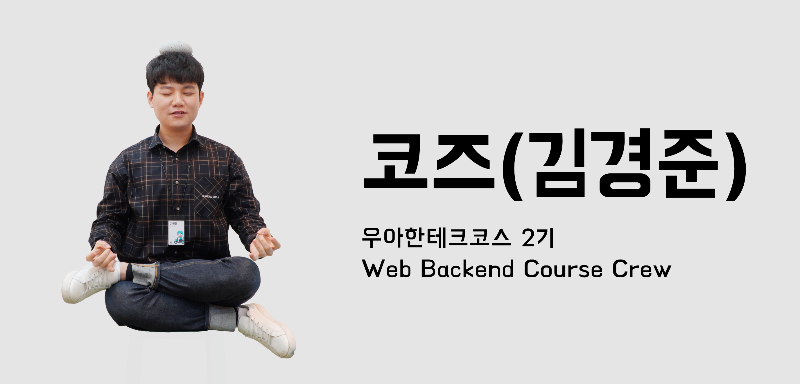
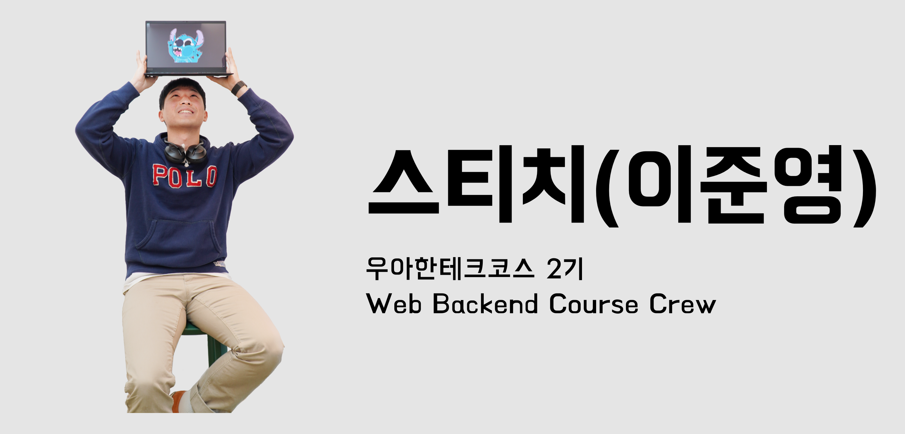

안녕하세요 우아한 테크코스 2기, 셀러리 컴퍼니에서 [직고래](https://play.google.com/store/apps/details?id=com.sellerleecompany.jikgorae)를 개발하고 있는 서브웨이입니다.
우아한 테크코스 2기 레벨3가 마무리되면서 셀러리 팀원들이 팀 프로젝트에 대한 회고를 진행하였는데요.
저희 팀원들의 회고 내용을 공유하고자 합니다.

---

## 실력
  개발자는 실력이 중요하다는 말에 부정하지는 않습니다. 장인이라는 표현을 하곤 하잖아요? 개발자는 머릿속에 흔히 떠오르는 회사원, 직장인과는 조금 다른 느낌이 있어요. 도자기를 빚는 공예가 같은 느낌도 있고…. 하지만 저에게 누군가가 개발자에게 가장 중요한 게 실력인가요? 라고 묻는다면, 음…. 글쎄요….

 팀 프로젝트 전까진 이런 생각을 가진 적이 별로 없었어요. 같이 일하고 싶은 사람이 되는 것, 그리고 소통이 중요하다는 것엔 공감하고 있었지만 그래도 개발자는 실력이 중요하다는 생각을 지우진 못했어요. 레벨 1과 2에서 항상 머릿속을 자리 잡고 있던 건 더 좋은 코드를 짜는 능력을 키우고 싶다. 그리고, 많은 기술이나 패러다임을 익히고 싶다는 생각 들이었어요. 하지만 팀 프로젝트를 진행하면서 다른 생각들이 자리 잡기 시작했죠.
 
  셀러리 컴퍼니는 저에게 여태까지 모르고 있던, 중요한 것이 무엇인지에 대해 알게 해줬네요.

## 좋은 팀

  프로젝트에 대한 열정이 사라진다면 팀이 성장할 수 없다고 생각했어요. 기술적이거나 코드적인 고민보단 어떻게 해야 모두가 즐겁게 할 수 있는 프로젝트를 만들 수 있을까 에 대한 고민을 하기 시작했어요. 한 명의 팀원으로서 열정을 잃지 않도록 노력했고 다른 팀원들의 열정을 고취시키려면 어떻게 해야 할까  고민했죠. 

 각자 갖고 있는 열정만큼 의견이 충돌하는 것 같아요. 자신이 프로젝트에 관심이 있고 욕심이 있는 만큼 강한 의견이 나오고, 강한 의견은 또 다른 의견들을 만났을 때 충돌하죠. 충돌을 피하자고 열정을 죽이거나 숨길 순 없잖아요. 그건 배려가 아닌 나쁜 신호라고 생각해요. 좋은 팀이라는 건 이런 의견 충돌을 잘 다루고 열정들의 방향을 어느 정도는 일치 시켰을 때 만들어진다는 생각이 들어요. 

 각각 팀원들의 열정 벡터를 내적해서 합하면 좋은 팀의 척도가 되겠네요….

 다들 좋은 팀을 만들기에 성공하셨나요? 전 솔직히 잘해냈다는 생각은 안 들어요. 지금도 일정에 쫒기고 있고 여전히 많은 태스크가 남아있어요. 지금은 프로덕트를 만드는데에 집중을 하고 있다고 생각이 들어요. 조금만 여유가 있었다면 좋은 팀을 만드는 데에 좀 더 집중할 수 있었을 것 같다는 아쉬움을 갖고 있어요. 레벨 4 때는 여유가 생기려나요…?

## 미래

  언젠가 이슈를 처리하면서 마치 직장에서 일을 하고 있는 것 같은 느낌을 받았어요. 팀 프로젝트는 미래에 직장 생활을 하게 되었을 때 어떻게 살아가야 할지 에 대해 조금은 힌트를 준 것 같아요. 

 좋은 환경에서 열정이 있는 팀원들을 만나 많은 것을 배우고 있어요. 각자가 가진 색깔들이 분명하고, 감히 제가 흉내 내기 힘든 장점들도 있었어요. 그 속에서 어떤 역할을 해야 할지, 어떻게 하면 팀에게 도움이 될 수 있을지 많이 고민하고 있어요. 이런 고민이 직장에 간다고, 팀이 바뀐다고 달라지진 않을 거라 생각해요. 

 항상 욕심이 많아요, 주변 사람들에게 좋은 영향력을 주면서 살고 싶어요. 개발에서도 멋진 기술들을 적용하고 싶어 하고 제가 좋다고 느꼈던 걸 다른 사람도 느꼈으면 좋겠다는 생각을 갖고 있어요. 그렇기 위해선 직장에서도, 그리고 팀 프로젝트에서도 팀원들의 신뢰를 얻는 게 선행 되어야겠죠. 열심히 하는 수밖에 없는 것 같아요. 하지만 묵묵히 하기보단 티를 내면서 하는 게 중요한 것 같아요. 열심히 하고, 열심히 하는 것을 사람들이 알아주게 된다면 신뢰를 얻을 수 있을 거라 생각해요.

 레벨 3가 끝나가네요. 막연하던 미래가 조금은 다가오고 있음을 느낍니다. 레벨 5는 레벨 3, 4와 많이 다를까요? 음…. 모르겠네요!

---

# 팀 프로젝트가 나에게 남긴 것

## 설렘과 두려움
level3 에서 하게 된 팀 프로젝트는 나의 첫 프로젝트다. 팀이 배정되고 설렘과 두려움이 공존했다.
소심한 성격 탓에 **팀과 어울리지 못하면 어쩌지?** 라는 쓸데없는 생각과 **경험이 부족한 내가
팀원으로서 민폐를 끼치면 어떡하지?** 라는 두려움이 나를 찾아왔고 동시에 **내 생의 첫 프로젝트라는 설렘**이 나에게 왔다.

## 1인분만 하자
나는 나를 낮게 평가하는 경향이 있다. 지금은 많이 고쳤지만 아마 남들과 비교를 많이 해서 그런 게 아닐까 싶다.
프로젝트 하는 동안 팀에 도움이 안 되면 어쩌지라는 생각이 들었다. 아마 level 2 때 슬럼프가 찾아와서 낮아진 자존감 때문에 그러지 않았을까 싶다.
그러던 도중 워니 코치님이 걱정이 많은 나에게 해주었던 말이 생각났다.

***일어나지 않을 일을 왜 미리 걱정하세요?***

그냥 열심히 해야겠다 생각했다. 팀원들에게 좋은 인상을 남기고 싶었다.
**1인분만 하자** 라는 생각으로 프로젝트를 시작했다.

## 동기부여
프로젝트가 시작됐다. 팀원들과 회의를 하고 같이 이슈를 만들며 같이 이야기를 하면서 많은 점을 느꼈다.
**왜 혼자 고립하면서 소심하게 살았지...** 라는 생각을 했다.
그들과 같이 있는 것만으로도 나를 반성하게 했다.
팀원들은 프로젝트 하면서 항상 즐거워보였고 배우려는 열정이 보였다. 
그들과 같이 이야기하는 것만으로 배울 점이 많았다.
나도 이들처럼 잘해지고 싶은 생각이 들었고 열심히 하고 싶어졌다.
프로젝트 끝나고 나서 후회가 남기 싫었었던 것 같다.
level2 기간 동안 힘들다며 무기력했던 내 모습이 떠올랐다.
 
***열심히 사는 사람들이 내 주변에도 이렇게 많은데 슬럼프가 왠말인가?!***

이렇게 열심히 사는 사람들에게 피해는 주지 말아야 하지 않은가. 그 뒤로 정말 열심히 했다.
'이전보다 더 열심히 했다.' 가 맞을지도 모르겠다. 하지만 어제의 나보단 더 열심히 살고 있었다.
오랜만에 동기부여가 되었고 그로부터 열정에 기름붓기가 시작됐다.
처음으로 막차를 타고 집에 가고 데모 준비를 하면서 밤을 새우고 코딩을 했다.

우테코의 한 크루가 했던 말이 생각이 났다.

***힘들었지만 좋았다.*** 

무엇인가 바라보고 열심히 하는 내 모습이 좋았다.
나는 내 팀원들에게 너무나도 고맙다. 내 마음속 무엇인가를 끌어 올려준 팀원들에게 감사할 뿐이다.

**꺼져가던 내 열정에 기름을 왕창 부어준 셀러리에게 감사함을 전하고 싶다.🙋🏽** 

---

### 정신을 차려보니

레벨 3의 끝을 향해 달리고 있다.

팀 프로젝트가 나에게 남긴 것이 무엇일까 생각하고 있는, 지금은 새벽 두 시 사십오분이다.

팀 프로젝트 동안 내게 남은 것들이 무엇이었을까. 머릿속을 헤집고 찾아다녔다. 하지만 언제나 그렇듯 내가 찾으려는 것들은 항상 내 눈에 보이지 않는 법이다.

이럴 때 사용하는 효과적인 방법이 있다. 마치 엉킨 실타래를 푸는 것처럼, 천천히 풀어가면서 따라가 보는 것이다. 

먼저, 맨 마지막 실타래부터 시작해보자.

 

### 방금 전까지 나는

UI/UX 디자인을 찾아보고 있었다. 이번 프로젝트의 마감 전까지 전체적인 디자인을 담당하기로 했기 때문이다.

개발자가 되기 위해서 온 우테코였다. 게다가 프로젝트는 개발 실력을 키우기 위한 더할 나위 없이 좋은 기회였다. 그런데 어쩌다가 디자인을 담당하겠다고 말한 것일까? 

생각해보면 내 성격이 원인이었을 것이다.

나는 내 마음에 들지 않으면 쉽사리 마음을 주지 못한다. 그런데 이번 프로젝트의 디자인에서 뭔가 부족함과 아쉬움을 느끼고 있었다.

그렇다고 내가 디자인에 감각이 있는가? 그건 또 아니다. 디자인을 잘하고 자신이 있어서 맡았기보단, 내 마음에 드는 디자인으로 프로젝트를 완성하고 싶었다.

그리고 지금, 내가 원하는 대로 디자인이 되지 않아서 조금 스트레스를 받고 있다. '백엔드 개발자가 되겠다고 여기 왔는데 지금 이걸 하고 있는 게 맞나?'라는 생각도 머릿속에 떠다닌다.

그래도 내가 머릿속에서 그리던 디자인을 프로젝트로 옮길 때면 뿌듯함을 느끼고 내 것을 만들고 있다는 생각에 만족감도 느낀다. '어떻게 디자인을 하는 것이 사용자에게 좀 더 편리할까'와 같은 고민을 할 때면 마치 스타트업의 디자이너 같은 느낌이 들어서 기분이 묘하기도 하다. 내가 선택한 파트였기에 즐기며 할 수 있었다. 

이번 경험을 통해서 나는 하고 싶은 일을 해야 하는 사람이란 걸 느꼈다. 하지만 앞으로도 내가 하고 싶은 일만 하고 살 수 있다는 보장은 없다.

그러나 지금, 내가 하고 싶은 것을 말했을 때 이를 믿고 지지해주는 팀과 함께하고 있다. 그렇기에 나의 의견을 개진해 나가기에도 두려움이 없다. 이런 팀과 함께함에 정말 감사함과 고마움을 느낀다. 그렇다고 이 말이 하고 싶은 것은 뭐든 할 수 있다는 말은 아니다. 팀원들을 합당한 이유로 설득해 나가고 모두가 동의하는 과정을 거친 후의 이야기다. 나는 이런 상황에서 어려움을 겪었던 것 같다.

그 당시의 실타래를 찾아가 보자.

 

### 팀원을 설득하는 나는

부족함이 많았다. 물론 지금도 부족함이 많다.

머릿속에 생각은 많았고 내가 생각하는 의견을 주장하고 싶은 마음도 컸다. 그러나 이를 말로 잘 풀어내지를 못했다.

내가 생각하는 나는 항상 말이 앞섰던 것 같다. 행동으로 보여주기 이전에 말이 앞섰다. 이는 내가 생각하는 정말 큰 단점 중 하나이다. 이 단점은 말하기에서도 여지없이 드러났다.

누군가를 설득하는 상황에서도 마음이 앞서고 말이 앞섰다. 그러다 보니 논리 정연한 말보다는 두서없는 말들로 내 생각을 풀어냈다. 내 입을 떠난 말들은 말하고자 하는 핵심을 향해 나가질 못하고 달처럼 그 주위를 맴돌고 있다. 하지만 눈치 빠른 팀원들이 내 생각을 빨리 알아차려 줘서 나의 말들은 잃어버린 경로를 다시 찾아간다.

그리고 지금, 나는 이런 문제점을 고치기 위해 듣는 연습을 하고 있다. 내가 하고자 하는 말을 조금은 접어두고 다른 사람의 의견을 더 들어보려고 노력한다. 누군가의 말에 집중하다 보면 내가 가진 생각들이 차분히 정리된다. 그리고 막연히 말하려고 했던 내 생각들이 말하고 있는 누군가의 생각과 다름이 없음을 느낄 때도 있다.

말을 잘하는 방법은 말을 잘 듣는 것이라는 이야기를 들은 기억이 있다. 지금의 나는 말을 잘하는 사람도 아니고 말을 잘 듣는 사람도 아니라 생각한다. 하지만, 아직 프로젝트는 끝나지 않았다. 이 프로젝트가 끝날 때쯤에 다시 글을 쓴다면, 그때는 내가 가진 단점이 장점이 되어 있기를 기대한다.

(~~안타깝지만, 지금 쓰고 있는 글도 두서없음이 느껴지는 것은 기분 탓일까~~)

천천히 풀어헤치다 보니 어느덧 실타래의 끝에 도착했다.

 

### 프로젝트의 팀에 배정된 나는

설렘에 가득 차 있었다.

모든 것이 이상적으로 흘러가고 상상한 모든 것이 순조롭게 해결되리라 믿고 있는, 아직 세상 물정을 모르는 어린아이와 같았다.

그렇기에 우리는, 세상 걱정 없는 어린아이처럼 즐겁게 웃고 떠들며 프로젝트를 진행할 수 있었다.

이런 분위기는 정말 좋은 사람들과 함께했기에 가능했다. 좋은 사람이 주위에 많은 이유는 그 사람이 좋은 사람이기 때문이라고 흔히들 말한다.

그렇다. 난 좋은 사람이다.

글을 적으면서 나의 장점을 생각해보니 난 꽤 긍정적이고 낙천적인 사람이다. 마지막으로 이 장점을 여기서 사용해봤다 :)

하지만 막상 이 장점이 우리 팀에서는 어떻게 작용했을까를 생각하니 잘 떠오르진 않는다. 그렇지만 단점이 된 적도 없다고 생각한다. 가만히 잇으면 절반은 간다는 말처럼 팀에 부정적인 영향을 미치지 않은 것만 하더라도 장점이 아닐까 위로해본다.

 

### 실타래는

끝까지 풀어 헤쳐졌다.

누군가에 의해 상처받고 속상했던 아픈 기억은 보이지 않았다. 단지 내가 이랬다면 어땠을까 하는 아쉬움만 존재했다. 

마지막으로 얼마 전에 본 시에 이런 문구가 있었다.

***뭔가가 시작되고 뭔가가 끝난다.***

***시작은 대체로 알겠는데 끝은 대체로 모른다.***

***끝났구나, 했는데 또 시작이기도 하고***

***끝이 아니구나 했는데 그게 끝일 수도 있다.***

***<황경신, 그때가 가장 슬프다 중에서>***

나는 지금 끝나지 않았다고 생각하지만, 뒤에 돌이켜보면 지금 끝일 수도 있다. 아니, 어쩌면 언젠가 끝났다고 생각하는 시점이 다시 시작일 지도 모른다.

지금이 시작인지 끝인지 알지 못하기에 걱정 없고 후회 없이 달려가고 있는 게 아닐까 싶다.