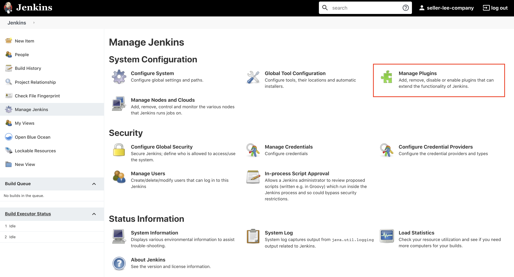
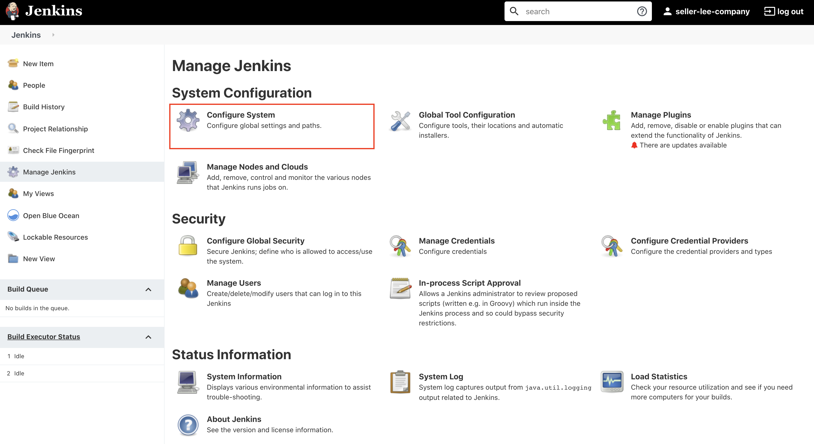
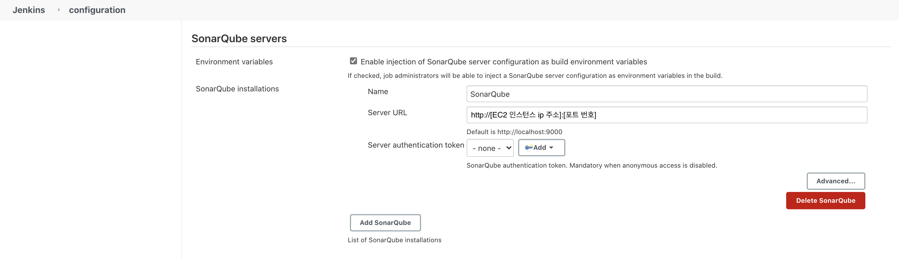
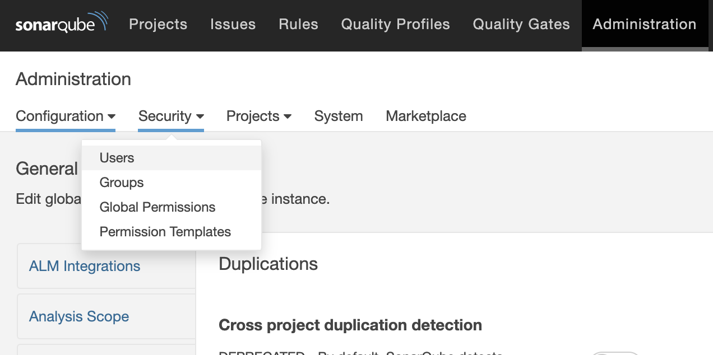
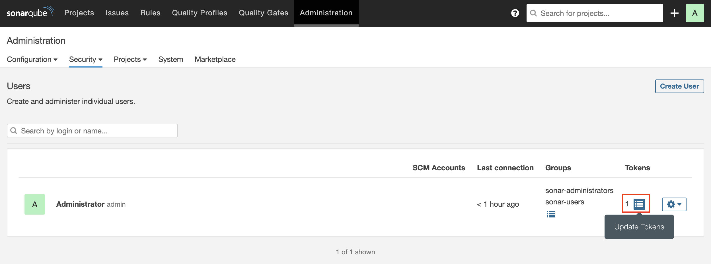
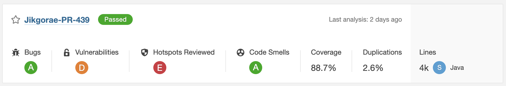
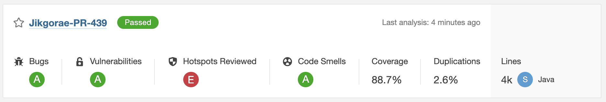
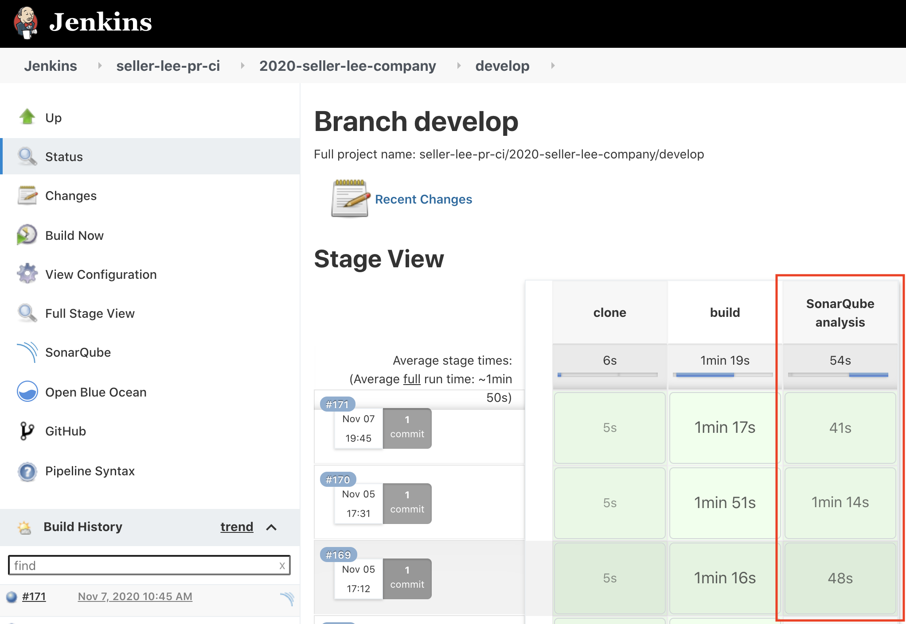
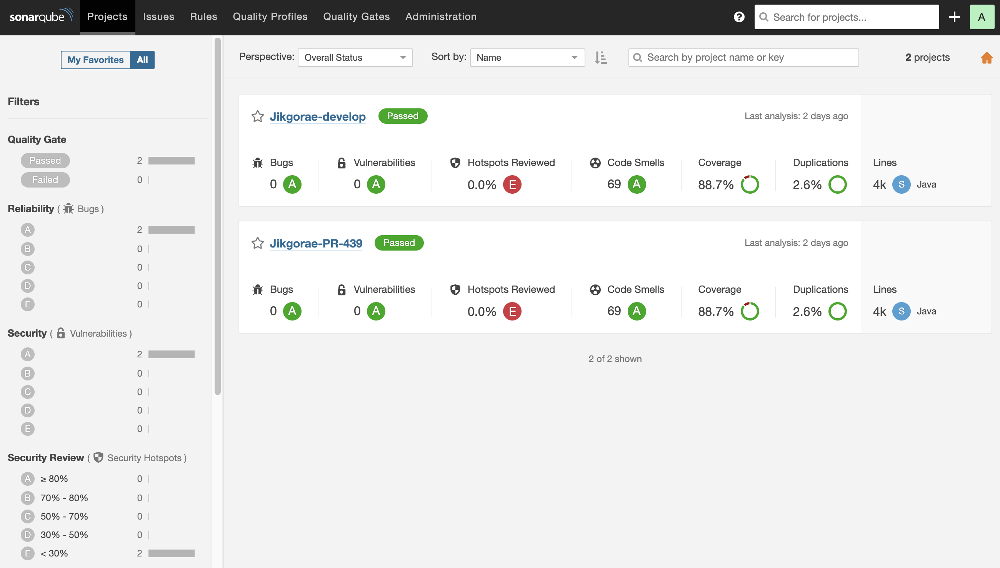
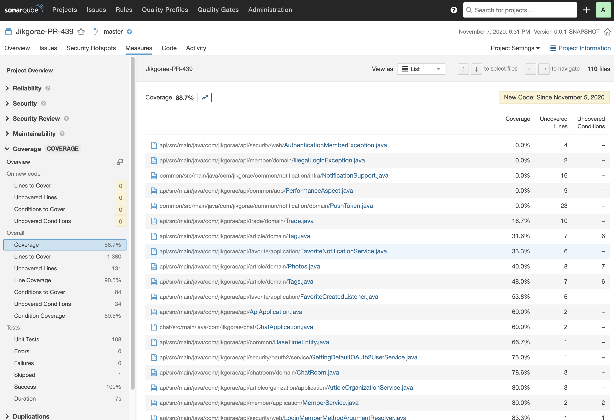

안녕하세요. 우아한테크코스 2기, 셀러리 컴퍼니에서 [직고래](https://sites.google.com/woowahan.com/wooteco-demo/%EC%A7%81%EA%B3%A0%EB%9E%98)를 개발하고 있는 스티치입니다.


[코드 커버리지 분석 도구 적용기 - 2편, JaCoCo 적용하기](https://seller-lee.github.io/java-code-coverage-tool-part2)에 이어서, 이번에는 프로젝트에 **정적 코드 분석 도구인 SonarQube를 어떻게 적용했는지**에 대해 소개해드리도록 하겠습니다.

---

## SonarQube란?


### 정적 코드 분석 도구

> **정적 프로그램 분석**(static program analysis)은 실제 실행 없이 컴퓨터 소프트웨어를 분석하는 것을 말한다. 대부분의 경우에 분석은 [소스 코드](https://ko.wikipedia.org/wiki/소스_코드)의 버전 중 하나의 형태로 수행되며, 가끔은 [목적 파일](https://ko.wikipedia.org/wiki/목적_파일) 형태로 분석된다. 이에 반하여 실행 중인 프로그램을 분석하는 것을 [동적 프로그램 분석](https://ko.wikipedia.org/wiki/동적_프로그램_분석)이라고 한다. - [wikipedia](https://ko.wikipedia.org/wiki/%EC%A0%95%EC%A0%81_%ED%94%84%EB%A1%9C%EA%B7%B8%EB%9E%A8_%EB%B6%84%EC%84%9D)

간단하게 정적 분석은 프로그램을 **실행하지 않은 상태**에서 소스 코드나 컴파일된 코드를 이용해 프로그램을 분석하는 방법이며, 동적 분석은 프로그램을 실제 환경이나 가상 환경에서 **실행해 보면서** 분석하는 방법입니다.

정적 분석은 소스 코드의 모든 부분을 확인할 수 있지만, 실행 환경에서의 상태를 정확히 알 수 없기 때문에 실행할 때에만 알 수 있는 데이터가 필요한 경우 정확히 분석할 수 없습니다. 반대로 동적 분석은 실제로 실행해 보면서 분석하기 때문에 실행 환경에서의 상태를 잘 알 수 있지만, 프로그램을 실행할 수 있는 환경을 구축하기 어려울 때가 많고 소스 코드의 모든 부분을 테스트해 보기 힘들다는 문제가 있습니다.

이렇게 각 분석 방식은 장단점이 존재하기 때문에 정적 분석은 주로 개발 단계에서 소스 코드의 구조적인 문제나 실수를 찾아내는 데 사용하며 동적 분석은 테스트나 모니터링할 때 사용합니다.

|             | 정적 분석(Static analysis)   | 동적 분석(Dynamic analysis) |
| ----------- | ---------------------------- | --------------------------- |
| 분석 대상   | 소스 코드 또는 컴파일된 코드 | 프로그램 실행 환경          |
| 테스트 범위 | 소스 코드의 모든 부분        | 실행 가능한 경로            |
| 활용        | 코드 상의 문제나 실수를 찾음 | 테스트, 모니터              |

### SonarQube

> **소나큐브**(SonarQube, 이전 이름: **소나**/Sonar)[[2\]](https://ko.wikipedia.org/wiki/소나큐브#cite_note-2)는 20개 이상의 [프로그래밍 언어](https://ko.wikipedia.org/wiki/프로그래밍_언어)에서 [버그](https://ko.wikipedia.org/wiki/소프트웨어_버그), [코드 스멜](https://ko.wikipedia.org/wiki/코드_스멜), 보안 취약점을 발견할 목적으로 정적 [코드 분석](https://ko.wikipedia.org/wiki/정적_프로그램_분석)으로 자동 리뷰를 수행하기 위한 지속적인 [코드 품질](https://ko.wikipedia.org/wiki/소프트웨어_품질) 검사용 [오픈 소스](https://ko.wikipedia.org/wiki/오픈_소스_소프트웨어) 플랫폼이다. [소나소스](https://ko.wikipedia.org/w/index.php?title=소나소스&action=edit&redlink=1)(SonarSource)가 개발하였다. 소나큐브는 [중복 코드](https://ko.wikipedia.org/wiki/중복_코드), [코딩 표준](https://ko.wikipedia.org/wiki/프로그래밍_코드_작성), [유닛 테스트](https://ko.wikipedia.org/wiki/유닛_테스트), [코드 커버리지](https://ko.wikipedia.org/wiki/코드_커버리지), [코드 복잡도](https://ko.wikipedia.org/w/index.php?title=순환_복잡도&action=edit&redlink=1), [주석](https://ko.wikipedia.org/wiki/주석_(프로그래밍)), [버그](https://ko.wikipedia.org/wiki/방어적_프로그래밍) 및 보안 취약점의 보고서를 제공한다.

**SonarQube**는 위에서 소개한 **정적 코드 분석 도구** 중 하나입니다.

정적 코드 분석 도구에는 PMD, FindBugs, CheckStyle 등이 있습니다. 저희 팀에서 SonarQube를 선택하게 된 주된 이유는 **레퍼런스가 많고** Github이나 Jenkins와의 연동을 통해 자동 정적 코드 분석을 구성할 수 있기 때문입니다.

~~(사실 레퍼런스가 많다는 점이 선택한 이유 중 90%가 넘는 것 같습니다)~~

그렇다면 SonarQube의 장점에는 어떤 것이 있을까요?

- 지속적인 인스펙션
  - 지속적인 통합과 같이 빌드와 연동하여 지속적으로 코드에 대한 인스펙션을 수행합니다. 
- 품질 중앙화
  - 개발된 조직의 코드의 품질을 중앙 저장소에서 가시화하고 단일 위치에서 관리합니다. 
- DevOps와의 통합
  - 다양한 빌드 시스템, CI 엔진과 통합되어 DevOps 실천을 지원합니다. 
- 품질 요구사항 설정
  - 품질 게이트를 통해 표준화된 코드 품질 요구사항을 설정합니다. 
- 다중 언어 분석
  - 20개가 넘는 프로그램 언어에 대한 코드 분석을 지원합니다. 
- 플러그인을 통한 확장
  - 다수의 플러그인을 통해 SonarQube의 기능을 확장할 수 있습니다. 
- 오픈소스 프로젝트
  - 오픈소스 프로젝트로 특정 범위까지 무료로 사용 가능하다.

지금부터는 이런 장점이 있는 SonarQube를 프로젝트에 적용하는 방법에 대해 소개하도록 하겠습니다!

---

## 프로젝트에 SonarQube 적용하기

### 개발 환경

#### 프로젝트

- Java 8
- Spring Boot 2.3.1
- Gradle 6.4.1

#### 인프라

- Ubuntu 18.04
- Jenkins 2.249.3
- SonarQube Server 8.5.1
- SonarQube Scanner 4.5.0

현재 직고래 프로젝트의 개발 환경은 위와 같습니다.

### 설치 환경 설정하기

SonarQube를 설치하는 방법은 **시스템에 직접 설치하는 방법**과 **Docker를 사용하여 설치하는 방법**이 있습니다. 저희는 프로젝트 전반에 걸처 Docker를 사용했기 때문에 SonarQube도 Docker를 통해 설치를 진행하겠습니다.

> 시스템 환경은 AWS EC2 인스턴스를 기반으로 설명하도록 하겠습니다. OS로는 Ubuntu 18.04를 사용하였습니다.

> SonarQube의 설치 방법에 대해 좀 더 자세히 알아보고 싶은 분들은 SonarQube 공식 문서의 [Try Out SonarQube](https://docs.sonarqube.org/latest/setup/get-started-2-minutes/)를 참고해주시기 바랍니다.

#### Docker 설치하기

[Docker Document](https://docs.docker.com/engine/install/ubuntu/)를 참고하여 설치를 진행했습니다. 공식 문서에는 환경 설정을 직접 하는 방법과 스크립트로 하는 방법이 있는데, SonarQube의 경우 실제 Product가 올라가는 상황은 아니기 때문에 **스크립트를 통해 진행**하였습니다.

> [Docker Document](https://docs.docker.com/engine/install/ubuntu/#install-using-the-convenience-script)를 보면 **Using these scripts is not recommended for production environments** 경고문이 있습니다. 실제 Product 환경에 Docker를 설치한다면 직접 환경 설정을 하면서 설치하기를 추천드립니다.

먼저 EC2 인스턴스의 패키지를 업데이트하고 스크립트를 다운받기 위해 curl을 설치하겠습니다.

```shell
sudo apt-get update
sudo apt-get curl
```

그 후 [스크립트](https://get.docker.com/)를 EC2 인스턴스에 설치하고 실행하면 됩니다.

```shell
curl -fsSL https://get.docker.com -o get-docker.sh
sudo sh get-docker.sh
```

이 상태로 마치면 Docker를 사용할 때마다 매번 `sudo`를 입력해야 하는 불편함이 있습니다. 로그인 계정을 docker 그룹에 추가하면 `sudo`를 입력하지 않고도 사용할 수 있습니다.

```shell
sudo usermod -aG docker $USER
```

#### SonarQube 이미지 설치하기

Docker 설치가 완료됐다면 이제 SonarQube 이미지를 가져오면 됩니다. [Docker Hub](https://hub.docker.com/_/sonarqube)에서 SonarQube의 이미지를 가져와서 설치합니다.

```shell
docker pull sonarqube
```

명령어 한 줄로 sonarqube의 설치는 끝이 납니다! (역시 Docker 최고🤩)

이미지가 잘 설치되었는지는 아래의 명령어를 통해 확인할 수 있습니다.

```shell
docker images
```


SonarQube가 정상적으로 설치됨을 확인할 수 있습니다.

### SonarQube 실행하기

이제 Docker로 설치한 SonarQube를 실행해보겠습니다.

```shell
docker run -d --name sonarqube -p 8080:9000 sonarqube
```

- `-d` : 컨테이너를 일반 프로세스가 아닌 데몬 프로세스 형태로 실행하여 프로세스가 끝나도 유지되도록 한다.
- `--name` : 실행할 컨테이너의 이름을 설정한다.
- `-p` : 컨테이너의 포트를 호스트의 포트와 바인딩해 연결할 수 있다. `-p [host(외부)의 port]:[container(내부)의 port]`이다.

SonarQube의 경우 **기본이 9000 포트**입니다. 현재 사용 중인 EC2가 9000 포트는 열려있지 않고 8000 포트만 열려있어서 8000 포트로 바인딩하였습니다.

> SonarQube의 기본 포트를 변경하고 싶다면 SonarQube 컨테이너에 들어간 후 `/config/sonar.properties` 파일의  `sonar.web.port` 프로퍼티를 수정하면 됩니다.

이렇게 실행하고 `http://[EC2 인스턴스 ip 주소]:[port 번호]`로 접속을 하면 실행된 SonarQube를 확인할 수 있습니다. 저희 프로젝트의 경우 8000 포트를 사용했기 때문에 `http://x.x.x.x:8000`로 접속하였습니다.

처음 접속하면 로그인을 해야하는데 기본 ID와 비밀번호는 모두 admin입니다. 이를 통해 접속하면 아래와 같은 페이지를 볼 수 있습니다.


### Jenkins 설정하기

#### SonarQube Scanner 플러그인 설치하기

프로젝트에 적용한 Jenkins에 **SonarQube Scanner 플러그인**을 설치합니다.





Jenkins의 Manage Jenkins > Manage Plugins > Available에서 SonarQube Scanner for Jenkins를 설치합니다.

> 위 사진은 Jenkins에 이미 SonarQube Scanner를 설치했기 때문에 Installed에서 조회가 된 모습입니다.

#### SonarQube Server 설정하기

플러그인 설치가 완료되면 Jenkins에 SonarQube Server에 대한 설정을 해줘야 합니다. 이번에는 Manage Jenkins > Configure System > SonarQube Server에서 설정을 진행하겠습니다.





먼저 Enable injection of SonarQube server configuration as build environment variables를 체크합니다.

그리고 Name에는 설정하고 싶은 이름을 입력하고 Server URL은 설치한 SonarQube Server의 주소를 입력합니다. Server authentication token의 경우는 따로 설정하지 않아도 됩니다.

#### SonarQube Scanner 설정하기

Jenkins 설정의 마지막 단계로 SonarQube Scanner를 설정합니다. Manage Jenkins > Global Tool Configuration > SonarQube servers에서 설정을 진행하겠습니다.


이때 Name의 경우 추후 Jenkinsfile을 설정할 때 사용해야 하기 때문에 잘 기억해두어야 합니다.

SonarQube Scanner Installer로 여러 종류가 있지만 그 중에서 가장 간단한 Maven Central을 사용하였습니다.

### Gradle 설정하기

#### SonarQube 플러그인 의존성 추가

이제 SonarQube로 소스 코드를 분석하는 설정을 하겠습니다. SonarQube로 소스 코드를 분석하는 방법은 여러가지가 있는데 그 중에서 프로젝트의 Gradle Task를 통해 분석하는 방법을 사용하겠습니다.

> [SonarQube Document - Analyzing Source Code](https://docs.sonarqube.org/latest/analysis/overview/)에 여러가지 방법이 소개되어 있습니다.

먼저 프로젝트의 기본 `build.gradle`에 [SonarQube 플러그인 의존성](https://plugins.gradle.org/plugin/org.sonarqube)을 추가해줘야 합니다.

```java
plugins {
    id 'org.sonarqube' version '3.0'
}
```

#### SonarQube Property 설정

현재 프로젝트 구조가 멀티 모듈이기 때문에 `build.gradle`의 `subprojects`에도 설정을 추가해줘야 합니다.

> 프로젝트의 멀티 모듈 구조에 대한 내용은 [이전 글](https://seller-lee.github.io/java-code-coverage-tool-part2)을 참고해주시기 바랍니다.

```java
subprojects {
    apply plugin: 'org.sonarqube'

    sonarqube {
        properties {
            property 'sonar.host.url', 'http://[EC2 인스턴스 ip 주소]:[포트 번호]'
            property 'sonar.login', 'SonarQube 로그인 토큰'
            property 'sonar.sources', 'src'
            property 'sonar.language', 'java'
            property 'sonar.projectVersion', '1.1.0-SNAPSHOT'
            property 'sonar.sourceEncoding', 'UTF-8'
            property 'sonar.coverage.jacoco.xmlReportPaths', '${buildDir}/reports/jacoco/test/jacocoTestReport.xml'
            property 'sonar.java.binaries', '${buildDir}/classes'
            property 'sonar.test.inclusions', '**/*Test.java'
            property 'sonar.exclusions', '**/test/**, **/Q*.java, **/*Doc*.java, **/resources/**'
        }
    }
}
```

sonarqube.property에 대해 간단히 알아보면

- `sonar.host.url` : 설치한 SonarQube의 주소이다. 앞서 젠킨스의 SonarQube Server에 입력한 주소와 동일하다.
- `sonar.login` : SonarQube Server에 로그인하여 발급받은 토큰이다.

  

  

  

  SonarQube Server 페이지에서 Administration > Security > Users > Tokens에서 토큰을 생성할 수 있습니다. 토큰의 경우 한 번 발급받으면 이후에 다시 토큰을 확인할 수 없기 때문에 잘 저장해둬야 합니다.

  여기서 발급받은 토큰을 해당 프로퍼티의 값으로 설정하면 됩니다.

- `sonar.sources` : 분석할 소스 파일의 공통 경로를 지정한다.
- `sonar.language` : 작성한 코드의 언어를 선택한다. java의 경우 커뮤니티 버전에서 무료로 정적 분석을 할 수 있다.
- `sonar.projectVersion` : SonarQube에서 분석한 소스의 버전을 지정한다.
- `sonar.coverage.jacoco.xmlReportPaths` : JaCoCo가 분석한 결과에 해당하는 xml 파일을 사용하여 커버리지를 분석한다. JaCoCo가 생성하는 xml report의 기본 경로가 `${buildDir}/reports/jacoco/test/jacocoTestReport.xml`이다.
- `sonar.java.binaries` : Java가 컴파일되면서 생성된 바이너리 파일을 분석한다.

  해당 프로퍼티를 설정하면 보다 정확한 코드 분석이 가능합니다. 이번 프로젝트에서도 해당 프로퍼티의 설정만으로 코드 분석의 정확도가 증가함을 확인할 수 있었습니다.

  - 프로퍼티 적용 전
    
  - 프로퍼티 적용 후(코드 변경 X)
    
- `sonar.test.inclusion` : 분석에 사용할 테스트 코드의 위치를 지정한다. `**/*Test.java` 의 경우 `src` 하위의 모든 디렉토리에서 Test.java로 끝나는 파일을 의미한다.
- `sonar.exclusions` : 커버리지 분석에서 제외할 파일의 위치를 지정한다.

#### 서브 모듈 Property 설정하기

멀티 모듈 구조에서 모듈별로 프로퍼티를 적용하고 싶다면 해당 모듈 하위의 `build.gradle` 파일에 설정을 추가하면 됩니다.

```java
sonarqube {
    properties {
        property 'sonar.exclusions', '**/test/**'
    }
}
```

추가적으로 프로퍼티에 폴더 경로나 파일 경로를 패턴을 통해 표현할 수 있습니다.

- `*` : 0개 또는 그 이상의 문자를 의미한다.
- `**` : 0개 또는 그 이상의 디렉토리를 의미한다.
- `?` : 하나의 문자에 해당한다.

### Jenkins Stage에 SonarQube 분석 추가하기

이제 위에서 설정한 SonarQube Gradle Task를 실행하는 Jenkins Stage를 추가합니다. 이번에는 SonarQube 코드 분석을 빌드 시점에서 실행하지 않고 Jenkins가 분석하는 시점에서 실행하도록 설정하였습니다.

> 빌드 시점에서 실행하려면 JaCoCo Gradle Task 설정에서 사용한 `finalizedBy`와 같은 함수로 실행 순서를 규정하면 가능합니다.

이는 프로젝트의 jenkinsfile을 통해 설정 가능합니다.

```shell
node {
    stage ('clone') {
        checkout scm
    }
    stage('build') {
        sh 'cd back && ./gradlew api:clean api:build && ./gradlew chat:clean chat:build'
    }
    stage('SonarQube analysis') {
      withSonarQubeEnv('SonarQube') {
        sh 'cd back && ./gradlew --info sonarqube' +
        ' -Dsonar.projectKey=Jikgorae-' + env.BRANCH_NAME +
        ' -Dsonar.projectName=Jikgorae-' + env.BRANCH_NAME
      }
    }
}
```

`clone` stage와 `build` stage는 기존에 존재하던 설정이고 `SonarQube analysis` stage 설정을 이번에 추가하였습니다.

`withSonarQubeEnv()` 함수의 인자로 들어가는 `'SonarQube'`는 앞에서 설정한 Jenkins의 SonarQube Scanner 이름입니다. 해당 이름과 같은 SonarQube Scanner를 사용하여 아래의 스크립트를 실행합니다.

이때 `-D` 옵션을 사용하여 **스크립트 실행 시점에서 프로퍼티를 추가**할 수 있습니다.

위 설정의 경우 projectKey와 projectName을 현재 브랜치의 이름으로 설정하도록 작성하였습니다. 각 프로퍼티 사이에는 공백이 있어야지 정상적으로 실행됩니다.

위의 설정이 완료되면 Jenkins가 분석하면서 함께 SonarQube analysis Stage를 실행합니다.

> 저희 프로젝트의 경우 PR을 통해 기능을 구현하고, 이를 develop에 merge하는(그리고 develop을 master로 merge하는) 전형적인 git-flow 브랜치 전략을 사용하고 있습니다.
>
> 따라서 PR이 생성되는 시점(브랜치가 새로 생성 & 새로운 커밋, 푸쉬), develop 또는 master에 머지되는 시점에 SonarQube analysis Stage가 실행됩니다.



### SonarQube Server 프로젝트

SonarQube 코드 분석이 정상적으로 마무리 됐다면 SonarQube 프로젝트가 생성될 것입니다.



제가 한 설정은 브랜치(PR, develop) 별로 하나의 프로젝트를 생성합니다.

>  프로젝트를 하나만 두고 한 프로젝트에서 여러 브랜치로 관리할 수도 있지만 이는 무료 버전인 Community 버전에서는 지원되지 않는 기능이어서 적용하지 못하였습니다.





SonarQube 프로젝트를 클릭하면 위와 같이 상세한 정보들을 볼 수 있습니다. SonarQube에서 관리해주는 소프트웨어 품질에 대해 간단하게 소개해보면

- Code Smell : 심각한 이슈는 아니지만 베스트 프렉티스에서 사소한 이슈들로 모듈성(modularity), 이해가능성(understandability), 변경가능성(changeability), 테스트용의성(testability), 재사용성(reusability) 등이 포함된다.
- Bugs : 일반적으로 잠재적인 버그 혹은 실행시간에 예상되는 동작을 하지 않는 코드를 나타낸다.
- Vulnerabilities : 해커들에게 잠재적인 약점이 될 수 있는 보안상의 이슈를 말한다. SQL 인젝션, 크로스 사이트 스크립팅과 같은 보안 취약성을 찾아낸다.
- Duplications : 코드 중복은 코드의 품질을 저해시키는 가장 큰 요인 중 하나이다.
- Unit Test : 단위테스트 커버리지를 통해 단위 테스트의 수행 정도와 수행한 테스트의 성공/실패 정보를 제공한다.
- Complexity : 코드의 순환 복잡도, 인지 복잡도를 측정합니다.
- Size : 소스코드 사이즈와 관련된 다양한 지표를 제공합니다.

~~(SonarQube를 적용한 직후여서 아직 Code smell이 많은 점 이해 부탁드립니다...😅)~~

---

## 정리하며

이번 글에서는 저희 프로젝트에서 **정적 코드 분석 도구인 SonarQube를 어떻게 적용했는지**를 간단히 소개해보았습니다.

코드의 품질 개선은 프로젝트가 오랜 기간 유지보수를 가능하게 합니다. 코드 커버리지(JaCoCo)와 같은 동적 코드 분석, 코드 품질 분석(SonarQube)과 같은 정적 코드 분석은 프로젝트의 코드 품질 개선에 많은 도움을 줄 수 있습니다.

코드만 작성한다고 끝!!!이 아니라 지속적으로 문제가 발생 가능한 부분을 수정하면서 개선해나간다면 더 좋은 프로젝트를 만들 수 있을 것이라 생각합니다 :)

다음 글에서는 JaCoCo와 함께 사용하면 효과가 **배**가 되는, **SonarQube**의 프로젝트 적용 방법을 소개하도록 하겠습니다.

코드 커버리지 분석 도구 & 정적 코드 분석 도구 적용기를 여기서 마치도록 하겠습니다. 지금까지 긴 글 읽어주셔서 감사합니다 🙇🏻‍♂️

### 관련 포스팅

- [코드 커버리지 분석 도구 적용기 - 1편, 코드 커버리지(Code Coverage)가 뭔가요?](https://seller-lee.github.io/java-code-coverage-tool-part1)
- [코드 커버리지 분석 도구 적용기 - 2편, JaCoCo 적용하기](https://seller-lee.github.io/java-code-coverage-tool-part2)

### 참고 링크 

- [자바 애플리케이션의 보안 검수 방법 살펴보기 - LINE Engineering](https://engineering.linecorp.com/ko/blog/static-analysis-of-java-app/)
- [[도커 스터디 #2] 개발환경 세팅 및 배포 실습 - Roseline Song](https://roseline124.github.io/kuberdocker/2019/07/17/docker-study02.html)
- [Sonarqube - 2 (도커로 설치하기) - Beom Dev Log](https://beomseok95.tistory.com/200)
- [소나큐브(SonarQube) 설치 및 IntelliJ와 연동해서 코드 정적분석하기 - 해어린 블로그](https://shinsunyoung.tistory.com/64)
- [SonarQube Scans in Jenkins Declarative Pipeline using SonarScanner - Igorski.co](https://igorski.co/sonarqube-scans-using-jenkins-declarative-pipelines/)
- [SonarQube 소개 - CURVE](https://confluence.curvc.com/pages/viewpage.action?pageId=6160780#id-1.SonarQube%EC%86%8C%EA%B0%9C-1.CodeSmells(Maintainability))